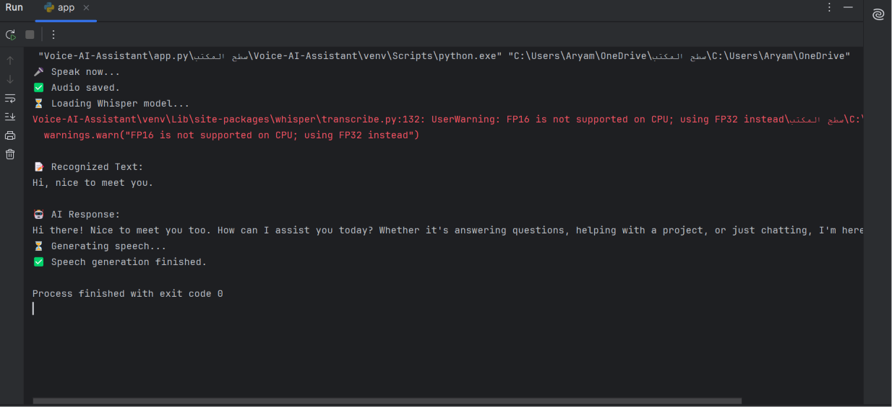

# 🎙️ Voice AI Assistant

A simple AI-powered Voice Assistant built with Python.

This project records the user's voice, converts speech into text using Whisper, generates an AI response using Cohere, and converts the response back into speech using Edge-TTS.

---

## 🚀 Features

- 🎤 Record voice from microphone
- 📝 Convert speech to text using OpenAI Whisper
- 🤖 Generate intelligent responses using Cohere LLM
- 🔊 Convert AI response to speech using Edge-TTS
- 💾 Save input and output audio files

---

## 🛠️ Technologies Used

- Python 3
- OpenAI Whisper
- Cohere API
- Edge-TTS
- SoundDevice
- SciPy
- Python Dotenv

---

## 📂 Project Structure

```
Voice-AI-Assistant/
│
├── app.py
├── README.md
├── requirements.txt
├── .gitignore

│
├── audio/
│   ├── input.wav
│   └── output.mp3
│
└── screenshots/
```

---

## ⚙️ Installation

Clone the repository:

```bash
git clone https://github.com/0xaryam/Voice-AI-Assistant.git
```

Go to the project folder:

```bash
cd Voice-AI-Assistant
```

Install the required packages:

```bash
pip install -r requirements.txt
```

Create a `.env` file and add your Cohere API key:

```env
COHERE_API_KEY=YOUR_API_KEY
```

---

## ▶️ How to Run

Run the application:

```bash
python app.py
```

The application will:

1. Record your voice
2. Convert speech to text
3. Generate an AI response
4. Convert the response into speech
5. Save the output as `audio/output.mp3`

---
##🎥 Demo

---
## 📌 Example Output

```text
🎤 Speak now...
✅ Audio saved.

📝 Recognized Text:
Hello, how are you?

🤖 AI Response:
Hello! I'm doing great. How can I help you today?

✅ Speech generation finished.
```
## 📸 Screenshots

Add screenshots of:

- Voice recording
- Speech recognition
- AI response
- Generated audio

Place all screenshots inside the `screenshots` folder

---

## 📦 Requirements

See `requirements.txt` for all required Python packages

---

---

## 👩‍💻 Author

**Aryam Aseiri**
